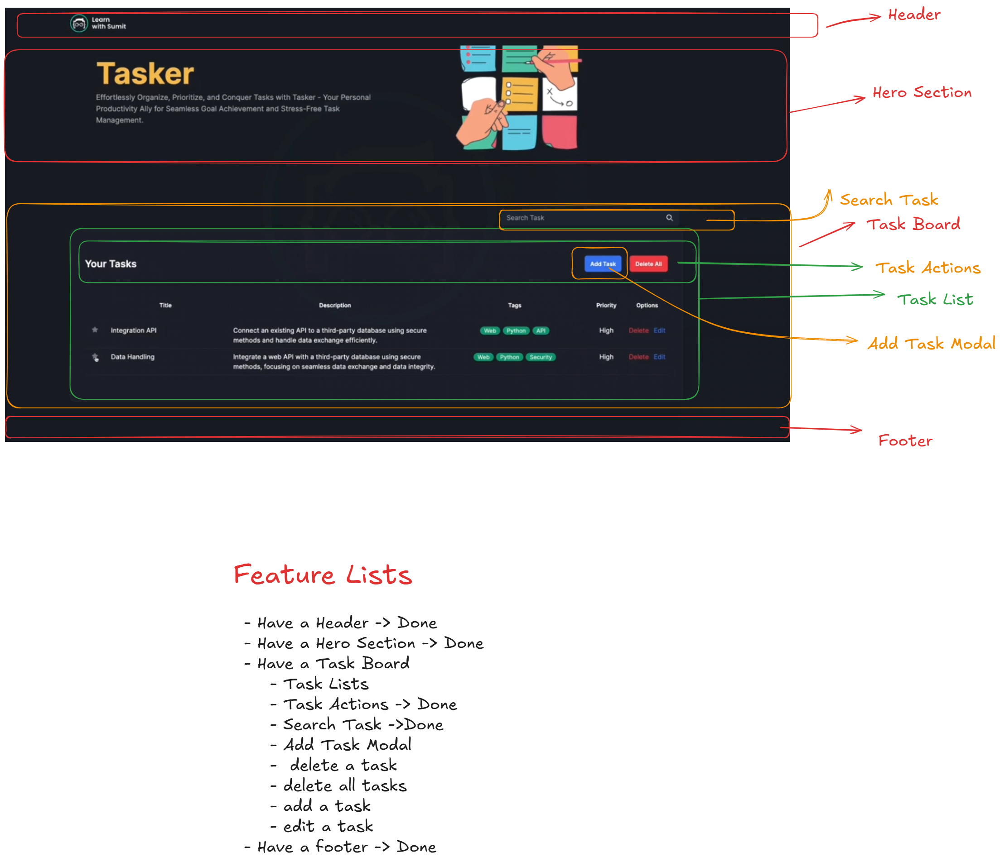

# 📝 Task Manager App

A simple and responsive task management application built with **React** and **Tailwind CSS**. Users can add, edit, delete individual tasks or delete all tasks at once.

## 🚀 Features

- ✅ Add a task
- ✏️ Edit an existing task
- ❌ Delete a task
- 🗑️ Delete all tasks
- 💡 Responsive UI using Tailwind CSS

## 🛠️ Tech Stack

- ⚛️ React
- 🎨 Tailwind CSS
- 🔁 React Hooks (useState, useEffect)

## 📸 Screenshots



## 🔧 Installation & Usage

Follow the steps below to run the project locally:

1. **Clone the repository**

```bash
git clone https://github.com/TawhidShakil/task-manager.git
